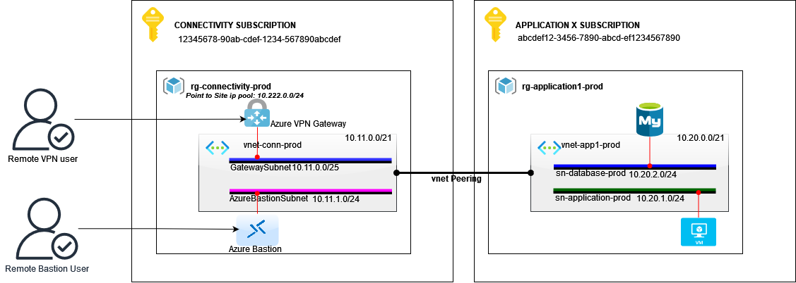

# Table of contents
1. [VNet Peering Bicep Deployment](#deployment)
   1. [Files in the Repository](#files)
   2. [Features](#features)
   3. [Parameters and Their Meanings](#parameters)
      1. [Key Notes on Variables](#key)
   4. [Prerequisites](#prereq)
   5. [Deployment Instructions](#instructions)
2. [Notes](#notes)
3. [Example setup of peering VNET with Virtual Network Gateway to another](#example)
   1. [Example parameters](#exampleParameters)
4. [License](#license)


<div id='deployment'/>
# VNet Peering Bicep Deployment

This project contains Bicep templates for deploying and configuring Virtual Network (VNet) peering in Microsoft Azure.

<div id='files'/>
## Files in the Repository
- **`main.bicep`**: Main Bicep template for deploying the VNets and associated resources.
- **`vnet-peering-deployment.bicep`**: Bicep module for configuring VNet peering.
- **`vnetdeploy.parameters.json`**: JSON file containing parameter values for customizing the deployment.

<div id='features'/>
## Features

- Configures peering between two VNets.
- Supports customization for forwarded traffic, gateway transit, and virtual network access.
- Works across different subscriptions and resource groups.

<div id='parameters'/>
## Parameters and Their Meanings

The following parameters are used in the deployment, along with their purpose in Azure VNet peering:

| Parameter Name                  | Description                                                                                      | Example Value                       |
|---------------------------------|--------------------------------------------------------------------------------------------------|-------------------------------------|
| `vnet1SubscriptionId`           | **Subscription ID of the first VNet.** Used to identify the subscription containing VNet1.      | `12345abc-1234-5678-9abc-defghijklm12` |
| `vnet1ResourceGroupName`        | **Resource group name for the first VNet.** Indicates where VNet1 is located.                  | `rg-example1-network01`                      |
| `vnet1Name`                     | **Name of the first VNet.** The name of the virtual network to be peered.                      | `vnet01`               |
| `vnet2SubscriptionId`           | **Subscription ID of the second VNet.** Used to identify the subscription containing VNet2.     | `12345abc-1234-5678-9abc-defghijklm12` |
| `vnet2ResourceGroupName`        | **Resource group name for the second VNet.** Indicates where VNet2 is located.                | `rg-example2-network01`                      |
| `vnet2Name`                     | **Name of the second VNet.** The name of the virtual network to be peered.                    | `vnet02`                      |
| `AllowTrafficToVNet1FromVNet2`    | **Allow forwarded traffic for VNet1.** Allow 'vnet1' to receive forwarded traffic from 'vnet2'. | `false`                              |
| `AllowForwardingVnet1ToVNet2`      | **Allow gateway transit for VNet1.** Allow gateway or route server in 'vnet1' to forward traffic to 'vnet2'. | `true`                             |
| `AllowAccessVNet1ToVNet2`| **Allow virtual network access from VNet1.** Allow 'vnet1' to access 'vnet2'. | `true`                              |
| `EnableRemoteGWVNet1ToVNet2`        | **Use remote gateways for VNet1.** Enable 'vnet1' to use 'vnet2's' remote gateway or route server. Note: `allowGatewayTransitVnet2` must be set to `true` for this to work. | `false`                             |
| `AllowTrafficToVNet2FromVNet1`    | **Allow forwarded traffic for VNet2.** Allow 'vnet2' to receive forwarded traffic from 'vnet1'.   | `true`                              |
| `AllowForwardingVnet2ToVNet1`      | **Allow gateway transit for VNet2.** Allow gateway or route server in 'vnet2' to forward traffic to 'vnet1'.     | `false`                             |
| `AllowAccessVNet2ToVNet1`| **Allow virtual network access for VNet2.** Allow 'vnet2' to access 'vnet1'. | `false`                              |
| `EnableRemoteGWVNet2ToVNet1`        | **Use remote gateways for VNet2.** Enable 'vnet2' to use 'vnet1' remote gateway or route server.         | `true`                             |

<div id='key'/>
### Key Notes on Variables:

1. **Virtual Network Peering**:
   - Allows virtual networks to communicate with each other.
   - Traffic between peered VNets is private, without the need for public IPs.

2. **Gateway Transit**:
   - Enables one VNet to share its VPN or ExpressRoute gateway with another VNet.

3. **Forwarded Traffic**:
   - Required if either VNet uses a network virtual appliance for routing traffic.

4. **Use Remote Gateways**:
   - Allows a VNet to utilize the gateway in the peered VNet, typically in a hub-and-spoke architecture.

<div id='prereq'/>
## Prerequisites

1. Azure CLI installed on your local machine.
2. A valid Azure subscription with sufficient permissions.
3. Ensure you are logged in to Azure CLI (`az login`).

<div id='instructions'/>
## Deployment Instructions

1. **Clone the repository**:
   ```bash
   git clone https://github.com/your-repository/vnet-peering.git
   cd vnet-peering

2. **Deploy Using the `parameters.json` File**

The `vnetdeploy.parameters.json` file contains predefined values for parameters required by the Bicep templates. This file ensures consistency and simplifies the deployment process.

**Structure of the Parameters File**

Below is a sample structure of the parameters file:
   ```json
   {
      "$schema": "https://schema.management.azure.com/schemas/2019-04-01/deploymentParameters.json#",
      "contentVersion": "1.0.0.0",
      "parameters": {
         "AllowTrafficToVNet1FromVNet2": {
               "value": false
         },
         "AllowForwardingVnet1ToVNet2": {
               "value": true
         },
         // Other parameter entries
      }
   }
```
   


3. **Deploy using Azure CLI (Subscription-Level Deployment)**:

   ```bash
   az deployment sub create --location <deployment-location> --template-file main.bicep --parameters @vnetdeploy.parameters.json

Replace <deployment-location> with the Azure region where you want the deployment metadata to reside (e.g., swedencentral, westeurope).

3. **Verify Deployment**:

    Go to the Azure Portal and navigate to the Virtual Networks.
    Check the peering status under each VNet's "Peerings" settings.

# Notes

    Modify the vnetdeploy.parameters.json file as needed to customize the deployment (e.g., enabling or disabling specific peering features).
    Ensure the SubscriptionId, ResourceGroupName, and VNetName values align with your Azure environment.

<div id='example'/>
# Example setup of peering VNET with Virtual Network Gateway to another

In this scenario we have in Connectivity Subscription VPN Gateway for point 2 site connectivity and Azure Bastion sevice from where users need to access VM and Database located on Aplication X subscription in virtual network vnet-app1-prod. 

For this we will create VNET peering between vnet-conn-prod and vnet-app1-prod. Allow traffic from vnet-conn-prod and behind Gateway service. 

**Requirements** 
- Allow traffic from vnet-conn-prod to vnet-app1-prod
- Allow traffic from P2S vpn pool (routable traffic)



<div id='exampleParameters'/>
## Example parameters

To be able to fullfil requirements we need to allow traffic between VNETs, Allow forwarded traffic from vnet-conn-prod and define vnet-app1-prod to use remote gateway.


| Parameter Name                  | Description                                                                                      | Example Value                       |
|---------------------------------|--------------------------------------------------------------------------------------------------|-------------------------------------|
| `vnet1SubscriptionId`           | **Subscription ID of the first VNet.** Used to identify the subscription containing vnet-conn-prod.      | `12345678-90ab-cdef-1234-567890abcdef` |
| `vnet1ResourceGroupName`        | **Resource group name for the first VNet.** Indicates where vnet-conn-prod is located.                  | `rg-connectivity-prod`                      |
| `vnet1Name`                     | **Name of the first VNet.** The name of the virtual network to be peered.                      | `vnet-conn-prod`               |
| `vnet2SubscriptionId`           | **Subscription ID of the second VNet.** Used to identify the subscription containing vnet-app1-prod.     | `abcdef12-3456-7890-abcd-ef1234567890` |
| `vnet2ResourceGroupName`        | **Resource group name for the second VNet.** Indicates where vnet-app1-prod is located.                | `rg-application1-prod`                      |
| `vnet2Name`                     | **Name of the second VNet.** The name of the virtual network to be peered.                    | `vnet-app1-prod`                      |
| `AllowTrafficToVNet1FromVNet2`    | **Allow forwarded traffic for vnet-conn-prod.** Allow 'vnet-conn-prod' to receive forwarded traffic from 'vnet-app1-prod'. | `false`                              |
| `AllowForwardingVnet1ToVNet2`      | **Allow gateway transit for vnet-conn-prod.** Allow gateway or route server in 'vnet-conn-prod' to forward traffic to 'vnet-app1-prod'. | `true`                             |
| `AllowAccessVNet1ToVNet2`| **Allow virtual network access from vnet-conn-prod.** Allow 'vnet-conn-prod' to access 'vnet-app1-prod'. | `true`                              |
| `EnableRemoteGWVNet1ToVNet2`        | **Use remote gateways for vnet-conn-prod.** Enable 'vnet-conn-prod' to use 'vnet-app1-prod's' remote gateway or route server. Note: `allowGatewayTransitVnet2` must be set to `true` for this to work. | `false`                             |
| `AllowTrafficToVNet2FromVNet1`    | **Allow forwarded traffic for vnet-app1-prod.** Allow 'vnet-app1-prod' to receive forwarded traffic from 'vnet-conn-prod'.   | `true`                              |
| `AllowForwardingVnet2ToVNet1`      | **Allow gateway transit for vnet-app1-prod.** Allow gateway or route server in 'vnet-app1-prod' to forward traffic to 'vnet-conn-prod'.     | `false`                             |
| `AllowAccessVNet2ToVNet1`| **Allow virtual network access for vnet-app1-prod.** Allow 'vnet-app1-prod' to access 'vnet-conn-prod'. | `false`                              |
| `EnableRemoteGWVNet2ToVNet1`        | **Use remote gateways for vnet-app1-prod.** Enable 'vnet-app1-prod' to use 'vnet-conn-prod' remote gateway or route server.         | `true`                             |


<div id='license'/>

# License

This project is licensed under the MIT License.